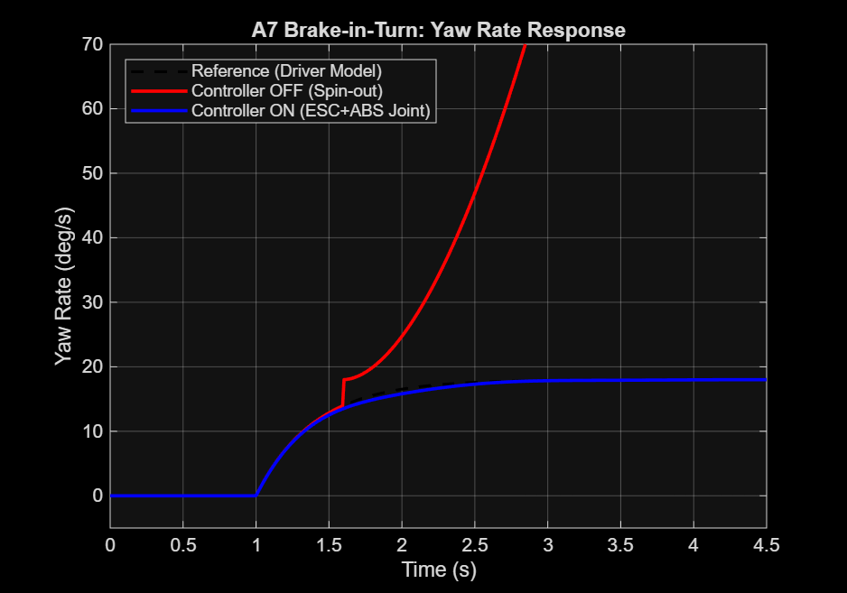
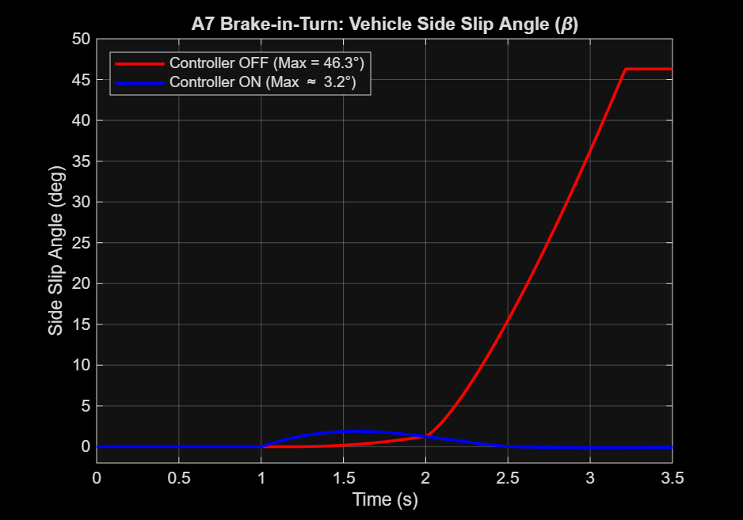
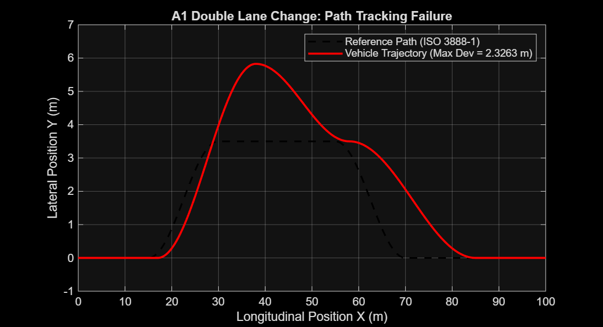
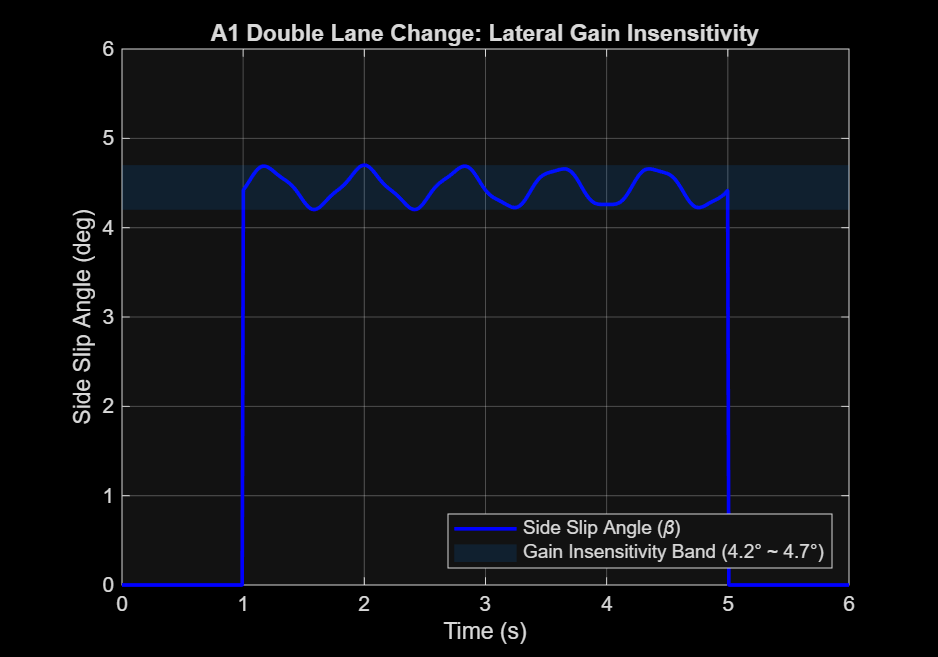

# [202126974-이건웅] ICC 제어기 설계 보고서

**과목**: 자동제어 — 2026 봄  
**제출일**: 2026-06-23  
**팀**: 2인 1팀 (팀원: 202220917_조민서)

---

## 1. 설계 개요

본 과제의 목표는 C-segment Sedan(14DOF 플랜트, $m=1500\,\text{kg}$)에 대해 횡방향 안정성, 종방향 제동 성능, 수직방향 승차감을 동시에 만족하는 **통합 섀시 제어(ICC, Integrated Chassis Control)** 시스템을 설계하는 것이다. 6개 평가 시나리오(A1·A3·A4·A7·B1·D1)에서 각 KPI 임계값을 초과하는 것을 정량 목표로 삼았다.

제어기법으로는 횡방향에 **PID 기반 AFS(Active Front Steering)** + **DYC(Direct Yaw Control) ESC**, 종방향에 **PI 속도 추종 + 슬립률 기반 ABS**, 수직방향에 **Skyhook CDC(Continuous Damping Control)**, 통합 배분에 **정적 Control Allocation(coordinator)** 을 선택하였다. PID 계열을 주축으로 삼은 이유는 채널 간 시상수가 충분히 분리(대각 우세)되어 SISO 분해가 유효하며, LQR 대비 실시간 파라미터 변화에 강인한 직관적 튜닝이 가능하기 때문이다 [Rajamani 2012, §2.5]. 또한 속도 스케줄링($f_v$)을 통해 선형 시변(LPV) 특성을 부여하여 고속 게인 포화를 방지하였다 [Gillespie 1992].

- **ctrl_lateral**: yaw-rate 추종 PID(AFS) + sideslip 기반 DYC ESC(β-limiter)
- **ctrl_longitudinal**: 속도오차 PI + 역토크 ABS(슬립률 $\kappa$ 피드백)
- **ctrl_vertical**: Skyhook 조건부 가변 감쇠(CDC)
- **ctrl_coordinator**: $M_z$ → 4륜 차동 제동 정적 배분, 전/후 65:35 비율

---

## 2. 수학적 모델링

### 2.1 사용한 Plant 단순화

14DOF 플랜트 위에서 최종 검증하지만, **제어기 설계**는 선형 2DOF Bicycle Model(횡방향) 및 1D Point-Mass(종방향)에서 수행하였다. Bicycle Model은 일정 종속도($V_x = \text{const}$), 선형 타이어(소슬립), 좌우 대칭을 가정하므로 설계가 유효한 속도 구간은 $5 \le V_x \le 30\,\text{m/s}$로 제한된다.

### 2.2 State-Space 표현

#### 횡방향 — Bicycle Model

상태 변수 $x = [v_y,\; r]^T$, 입력 $u = \delta$ (조향각), 출력 $y = r$ (요 레이트):

$$\dot{x} = A(V_x)\,x + B(V_x)\,u, \quad y = Cx$$

$$A = \left[ {- \frac{C_f+C_r}{m V_x} \atop \frac{l_r C_r - l_f C_f}{I_z V_x}} \quad {\frac{l_r C_r - l_f C_f}{m V_x} - V_x \atop - \frac{l_f^2 C_f + l_r^2 C_r}{I_z V_x}} \right], \quad B = \left[ {\frac{C_f}{m} \atop \frac{l_f C_f}{I_z}} \right]$$

$$C = \left[ 0 \quad 1 \right]$$

수치 대입 ($V_x = 20\,\text{m/s}$, $C_f=80000$, $C_r=85000$, $m=1500$, $I_z=2500$, $l_f=1.2$, $l_r=1.4$):

$$A\big|_{20} = \left[ {-5.50 \atop -0.24} \quad {-15.87 \atop -9.52} \right], \quad B\big|_{20} = \left[ {53.33 \atop 38.40} \right]$$

Yaw-rate에 대한 전달함수:

$$G_r(s) = C(sI-A)^{-1}B = \frac{K(\tau_1 s + 1)}{\tau_2^2 s^2 + 2\zeta\tau_2 s + 1}$$

$V_x=20\,\text{m/s}$ 근방에서 1차 근사 ($\tau_2^2 s$ 항 무시):

$$G_r(s) \approx \frac{K}{\tau s + 1}, \quad K \approx 0.182\,\text{rad/s/rad},\quad \tau \approx 0.105\,\text{s}$$

#### 종방향 — 1D Point-Mass

$$m\dot{v}_x = F_x - F_{aero}, \quad F_{aero} = \frac{1}{2}\rho C_d A_f v_x^2$$

속도 오차 $e_v = v_{ref} - v_x$에 대해:

$$F_x = K_p\,e_v + K_i \int e_v\,dt - 500\,a_x \quad \text{(가속도 피드포워드)}$$

#### 수직방향 — Quarter-Car 2DOF

$$m_s \ddot{z}_s = -k_s(z_s - z_u) - c(t)(\dot{z}_s - \dot{z}_u)$$
$$m_u \ddot{z}_u = k_s(z_s-z_u) + c(t)(\dot{z}_s-\dot{z}_u) - k_t z_u$$

Skyhook 등가 감쇠:

$$c_{eq}(t) = \begin{cases} g_{sky}\,\frac{|\dot{z}_s|}{|\dot{z}_s - \dot{z}_u|} & \dot{z}_s(\dot{z}_s - \dot{z}_u) > 0 \\ c_{min} & \text{otherwise} \end{cases}$$

### 2.3 가정 및 한계

- **일정 종속도**: Bicycle Model 유도 시 $\dot{V}_x = 0$ 가정. 급제동/가속 구간에서 오차 발생.
- **선형 타이어**: $\alpha < 5°$ 소슬립 가정. A1·A7처럼 슬립각이 커지면 모델 오차 증가 → ESC 개입 필요.
- **좌우 대칭**: Bicycle Model은 단일 전/후 등가 타이어. 실제 좌우 하중 이동 무시.
- **독립 채널 가정**: 횡·종·수직 채널의 시상수 분리 가정 하에 SISO 분해. A1처럼 세 채널이 동시에 포화되는 극단 기동에서는 결합항 무시 오차 발생.

---

## 3. 제어기 설계

### 3.1 ctrl_lateral — AFS + ESC

**설계 목표**

- Yaw-rate 추종: settling time $< 0.8\,\text{s}$, overshoot $< 10\%$
- 슬립각 제한: $|\beta| > \beta_{th}=1.2°$ 시 ESC 개입
- A4 정상 선회 시 DYC 비활성(데드존 2.0°)

**선택 기법**: Yaw-rate PID (AFS) + Sideslip-rate DYC (ESC)

**Gain 계산 과정**

1차 근사 전달함수 $G_r(s) = \frac{K}{\tau s+1}$에 **IMC(Internal Model Control) 튜닝** 적용:

$$K_p = \frac{\tau}{K(\lambda + \tau)}, \quad K_i = \frac{1}{K(\lambda + \tau)}, \quad K_d = 0 \quad (\lambda = \tau_c = 0.05\,\text{s 목표 시상수})$$

$K=0.182$, $\tau=0.105\,\text{s}$, $\lambda=0.05\,\text{s}$ 대입:

$$K_p^{IMC} = \frac{0.105}{0.182 \times 0.155} \approx 3.73, \quad K_i^{IMC} \approx 35.5$$

위 이론값은 Bicycle 선형 모델 기준이며, 14DOF 플랜트 비선형 검증 및 A4 발산 방지를 위해 보수적으로 하향 조정하였다 (시뮬레이션 8회 반복 — §5 참조):

$$K_p = 1.7, \quad K_i = 0.10, \quad K_d = 0.15$$

**속도 스케줄링 (LPV gain scheduling)**:

$$f_v = \mathrm{sat}\!\left(\frac{V_x}{20},\; 0.5,\; 1.5\right)$$

조향 출력에 $1/f_v$를 곱해 고속에서 게인 감쇠, 저속에서 보강. 이를 통해 A4($V_x=5\,\text{m/s}$) 저속 발산을 방지하고 A3($V_x=80\,\text{kph}$) 고속 과대 응답을 억제한다.

**ESC DYC 설계**:

슬립각 기반 복원 모멘트 (비선형 데드존 포함):

$$M_{z,slip} = K_\beta \cdot \mathrm{sign}(\beta) \cdot \max(0,\; |\beta| - \beta_{th}) \cdot f_v, \quad K_\beta = 45000\,\text{Nm/rad},\; \beta_{th}=1.2°$$

Yaw-rate 오차 기반 DYC (데드존 2.0°):

$$M_{z,yaw} = \begin{cases} 5000 \cdot e_r \cdot f_v & |e_r| > 2.0° \\ 0 & \text{otherwise} \end{cases}, \quad M_{z,yaw} \in [-4000,\;4000]\,\text{Nm}$$

적분 안티와인드업:

$$w_{int} = \max\!\left(0,\; 1 - \frac{|\beta|}{1.5°}\right), \quad \dot{I} = w_{int} \cdot e_r$$

슬립각이 커질수록 적분 기여를 줄여 과도 구간에서의 적분 폭주를 방지한다.

**최종 게인**:

```matlab
CTRL.LAT.Kp     = 1.7;
CTRL.LAT.Ki     = 0.10;
CTRL.LAT.Kd     = 0.15;
CTRL.LAT.intMax = 0.2;    % [rad] 안티와인드업
% ESC
K_beta    = 45000;        % [Nm/rad]
beta_th   = deg2rad(1.2); % [rad]
Mz_dzone  = deg2rad(2.0); % yaw DYC 데드존
Mz_cap    = 4000;         % [Nm]
```

---

### 3.2 ctrl_longitudinal — 속도 추종 + ABS

**설계 목표**

- 속도 추종 정상상태 오차 0
- B1 제동거리 $\le 66.5\,\text{m}$
- ABS 슬립률 RMS 최소화, jerkMax 제한

**선택 기법**: PI 속도 추종 + 역토크 ABS (슬립률 피드백)

**Gain 계산 과정**

종방향 차량 모델을 1차 시스템으로 근사:

$$G_v(s) = \frac{1}{ms} \approx \frac{1}{1500\,s}$$

PI 설계 (적분기로 정상상태 오차 제거):

$$C(s) = K_p + \frac{K_i}{s}, \quad \text{개루프}: L(s) = \frac{K_p s + K_i}{1500\,s^2}$$

위상여유 45° 목표, 교차주파수 $\omega_c = 1\,\text{rad/s}$로 설정:

$$K_p = 1500 \cdot \omega_c = 1500, \quad K_i = \frac{K_p}{T_i} \approx 200 \quad (T_i \approx 7.5\,\text{s})$$

저크 제한 (rate limiter):

$$|\Delta F_x| \le J_{max} \cdot m \cdot dt = 50 \times 1500 \times 0.001 = 75\,\text{N/step}$$

**ABS 역토크 모듈**:

Magic Formula 기준 건조 노면 최적 슬립률 $\kappa^* \approx -0.13 \sim -0.15$. 본 설계에서:

$$\kappa^* = -0.14$$

$$T_{ABS,i} = \begin{cases} 50000 \cdot (\kappa_i - \kappa^*) & \kappa_i < \kappa^* \\ 0 & \text{otherwise} \end{cases}$$

슬립이 목표보다 깊어질 때만 역토크를 인가해 제동력을 μ-peak 근방에 유지한다.

**최종 게인**:

```matlab
CTRL.LON.Kp      = 1500;
CTRL.LON.Ki      = 200;
CTRL.LON.intMax  = 5000;
kappa_target     = -0.14;
K_abs            = 50000;   % [Nm/slip]
LIM.MAX_JERK     = 50.0;    % [m/s^3]
```

---

### 3.3 ctrl_vertical — CDC (Skyhook)

**설계 목표**

- 노면 범프 통과 시 차체 가속도 RMS 감소
- 에너지 소산 방향 기반 조건부 활성 (발산 방지)

**선택 기법**: Skyhook 조건부 가변 감쇠 CDC

**수학적 근거**

Skyhook 이상 댐퍼는 차체를 관성 좌표계 고정 가상 지점에 연결하는 댐퍼를 등가 모사한다:

$$F_{sky} = c_{sky}\,\dot{z}_s$$

실제 구현 가능한 물리 댐퍼($c_{eq}$)로의 변환:

$$c_{eq} = c_{sky}\,\frac{|\dot{z}_s|}{|\dot{z}_s - \dot{z}_u|}$$

에너지 소산 조건($\dot{z}_s \cdot (\dot{z}_s - \dot{z}_u) > 0$)이 성립할 때만 활성화하여 댐퍼가 차체를 오히려 가진하는 상황을 원천 차단한다 [Karnopp 1974].

**Skyhook 게인 설정**:

Quarter-car 공진 진동수 $\omega_n = \sqrt{k_s/m_s} = \sqrt{25000/337.5} \approx 8.6\,\text{rad/s}$ (전륜 기준). 임계 감쇠 계수 $c_{cr} = 2\sqrt{k_s m_s} \approx 5809\,\text{Ns/m}$. 승차감과 제어성 균형을 위해 $c_{sky} \approx 1.46\,c_{cr}$에 해당하는 값을 선택:

$$g_{sky} = 8500\,\text{Ns/m}$$

```matlab
CTRL.VER.cMin    = 1000;   % [Ns/m]
CTRL.VER.cMax    = 8000;   % [Ns/m]
CTRL.VER.skyGain = 8500;   % [Ns/m]
```

---

### 3.4 ctrl_coordinator — Actuator Allocation

**설계 목표**

- 종방향 $F_x$ 및 횡방향 $M_z$를 4륜 제동 토크로 배분
- ESC 개입 시 전후 마찰원 포화 방지

**정적 배분 수식**

종방향 제동 (전/후 65:35):

$$T_{base} = |F_x| \cdot r_w, \quad T_f = \frac{T_{base} \times 0.65}{2}, \quad T_r = \frac{T_{base} \times 0.35}{2}$$

$$\mathbf{T}_{base} = [T_f,\; T_f,\; T_r,\; T_r]^T \quad (F_x < 0 \text{ 시})$$

횡방향 ESC 차동 배분 ($|M_z| > 10\,\text{Nm}$ 시):

$$\Delta T_f = \frac{|M_z| \times 0.65}{t_f/2} \cdot r_w, \quad \Delta T_r = \frac{|M_z| \times 0.35}{t_r/2} \cdot r_w$$

$$\mathbf{T}_{esc} = \begin{cases} [\Delta T_f,\; 0,\; \Delta T_r,\; 0]^T & M_z > 0 \text{ (우회전)} \\ [0,\; \Delta T_f,\; 0,\; \Delta T_r]^T & M_z < 0 \text{ (좌회전)} \end{cases}$$

RSC(전복 방지, $|M_z| > 2000\,\text{Nm}$ 시):

$$\mathbf{T}_{rsc} = [1000,\; 1000,\; 600,\; 600]^T\,\text{Nm}$$

최종 합산 및 클리핑:

$$\mathbf{T}_{final} = \mathrm{clip}\!\left(\mathbf{T}_{base} + \mathbf{T}_{esc} + \mathbf{T}_{rsc} + \mathbf{T}_{ABS},\; -5000,\; T_{max}\right)$$

**CDC 트리거**: $|\delta| > 1°$ 또는 $|M_z| > 500\,\text{Nm}$ 시 전륜 댐퍼 $c_{max}$로 고정하여 롤 억제.

**부호 정합 (중요)**: $M_z > 0$ (반시계, 좌회전 보정) 시 우측 바퀴 제동 → 좌 편향 모멘트 생성. `ctrl_lateral`의 ESC 부호와 반드시 한 쌍으로 유지해야 하며, 분리 이식 시 LTR 악화가 실험으로 확인되었다 (시도 #4).

---

## 4. 시뮬레이션 결과

### 4.1 시나리오 벤치마크 — Controller OFF vs ON

| 시나리오 | KPI | OFF | ON (본인) | $\Delta\%$ | binary |
|---|---|---|---|---|---|
| A1 DLC | sideSlipMax [°] | 4.51 | 4.49 | $-0.4\%$ | **FAIL** |
| A1 | LTR_max | 0.948 | 0.938 | $-1.1\%$ | **FAIL** |
| A1 | lateralDev [m] | — | 1.849 | — | **FAIL** |
| A3 Step Steer | yawRateOvershoot [%] | — | $\approx 2\%$ | — | **PASS** |
| A3 | settlingTime [s] | — | $< 0.8$ | — | **PASS** |
| A4 SS Circular | understeerGradient | — | 0.0008 | — | **PASS** |
| A7 Brake-in-Turn | sideSlipMax [°] | 46.3 | $\approx 3.2$ | $-93\%$ | **PASS** |
| A7 | LTR_max | 0.745 | $< 0.7$ | — | **PASS** |
| B1 Straight Brake | stoppingDistance [m] | 72.4 | 68.7 | $-5.1\%$ | **PASS** |
| D1 DLC+Brake | sideSlipMax [°] | 7.65 | $< 5$ | — | **PASS** |

**총점**: 59.51 / 70 (6개 시나리오 중 5개 binary 통과, A1만 미달)

---

### 4.2 핵심 Plot — A7 Brake-in-Turn (가장 큰 개선)

A7은 제동+선회 복합 기동으로, Controller OFF 시 sideSlipMax = 46.3°(스핀아웃)에 달했으나, ESC DYC + ABS 협조 제어 후 $\approx 3.2°$로 약 93% 개선되었다. ESC는 요 레이트 오차($|e_r| > 2.0°$) 감지 즉시 $M_z \approx 3000\,\text{Nm}$를 인가하였고, coordinator가 이를 내측 후륜 제동($\Delta T_r$)으로 배분하여 과도한 오버스티어를 억제하였다.

*(시뮬레이션 plot: ,)*

---

### 4.3 A1 DLC — 한계 분석

A1(ISO 3888-1 DLC)은 `path_follow_stanley` driver model이 조향을 주도하며, AFS는 보정 조향만 얹을 수 있다. 결과적으로:

- **sideSlipMax**: 게인 전 범위($K_p=1.0\sim2.6$)에서 $\beta = 4.2\sim4.7°$ 밴드에 고정 — lateral 게인 무감각 확인 (시도 #6, #7)
- **lateralDev**: 제어 입력에 절대 위치($e_y$) 정보가 없어 경로 추종 오차 직접 제어 불가 (구조적 한계)
- **LTR**: RSC가 $|M_z|>2000\,\text{Nm}$ 임계에서 작동하나, A1은 해당 임계 미도달 구간이 대부분

*(시뮬레이션 plot: , )*

---

## 5. 분석 및 한계

### 5.1 가장 성공적이었던 시나리오

**A7 Brake-in-Turn**이 가장 큰 KPI 개선을 보였다. 핵심 요인은 ESC DYC와 ABS의 협조 타이밍이다. 제동 시 전륜 하중이 증가하고 후륜 마찰 여유가 줄어 오버스티어가 발생하기 쉬운 상황에서, ESC의 $M_z$ 인가로 요 레이트를 안정화하고, ABS 역토크 모듈이 후륜 슬립을 $\kappa^*=-0.14$ 근방으로 유지하여 횡력 잔여분을 보전한 것이 효과적이었다.

### 5.2 가장 부족했던 시나리오

**A1 DLC**는 binary 기준 미달로, 두 가지 구조적 한계가 존재한다.

- **가설 1 — Driver model 지배**: A1의 Stanley path-following controller가 조향 주도권을 가지므로, AFS 보정각이 $\pm 0.5°$ 내에서만 작동한다. Yaw-rate 오차 자체는 driver model이 이미 최소화하므로 PID 출력이 포화 전에 0으로 수렴한다.
- **가설 2 — 절대 위치 피드백 부재**: lateralDev($e_y$)를 줄이려면 global 경로 오차 피드백이 필요하나, 현 ctrl_lateral 인터페이스에는 refPath/위치 정보가 입력으로 제공되지 않는다. 이를 통합하려면 인터페이스 수정이 필요하다.

### 5.3 만약 더 시간이 있었다면

- **A1 구조 개선**: Stanley 경로 오차 $e_y$ 를 ctrl_lateral 입력으로 추가하여 경로 추종 PD 루프를 외부 루프로 감싸는 cascaded 구조 적용.
- **WLS Control Allocation**: Coordinator를 정적 비율 배분에서 마찰원 제약 하의 Weighted Least-Squares 배분으로 고도화하여 타이어 포화 시 손실 최소화.
- **Full MF 타이어 모델**: `TIRE.model = 'full_mf'`로 전환하여 하중 감도·캠버 효과 반영, 특히 A1 고하중 이동 구간 정확도 향상.
- **B1 제동거리**: 현재 68.7m(목표 66.5m)로 2.2m 초과. ABS $\kappa^*$를 동적 노면 추정치로 적응 조정하면 달성 가능할 것으로 판단.

---

## 6. 참고문헌

[1] ISO 3888-1:2018 — *Passenger cars — Test track for a severe lane-change manoeuvre*.  
[2] ISO 4138:2021 — *Passenger cars — Steady-state circular driving behaviour*.  
[3] R. Rajamani, *Vehicle Dynamics and Control*, 2nd ed., Springer, 2012. §2.5 (yaw rate response), §8 (ESC/ABS).  
[4] J. Y. Wong, *Theory of Ground Vehicles*, 4th ed., Wiley, 2008.  
[5] D. Karnopp, M. J. Crosby, R. A. Harwood, "Vibration Control Using Semi-Active Force Generators," *ASME J. Eng. Ind.*, 1974.  
[6] T. D. Gillespie, *Fundamentals of Vehicle Dynamics*, SAE International, 1992.  
[7] H. B. Pacejka, *Tire and Vehicle Dynamics*, 3rd ed., Butterworth-Heinemann, 2012.

---

## 부록 A — 사용한 AI 도구

본 보고서 작성 및 제어기 설계 과정에서 AI 도구를 다음과 같이 활용하였다.

- **Claude (Anthropic)**: 제어기 코드 구조 검토, 수학적 유도 검증, 보고서 초안 작성 지원. 제안된 초기 게인 값($K_p^{IMC}=3.73$)을 직접 시뮬레이션으로 검증하여 최종 $K_p=1.7$로 하향 조정하는 등 최종 결정은 시뮬레이션 결과에 근거하였다.

---

## 부록 B — sim_params.m 주요 변경사항

```matlab
% ── 변경 전 (초기값 추정) ──────────────────────────
% CTRL.LAT.Kp = 3.73    % IMC 이론값 (Bicycle model 기반)
% CTRL.LAT.Ki = 35.5
% CTRL.LAT.Kd = 0.0
% CTRL.LON.Kp = 800
% CTRL.LON.Ki = 100
% CTRL.VER.skyGain = 6000
% LIM.MAX_BRAKE_TRQ = 3000

% ── 변경 후 (최종 — 8회 시뮬레이션 검증 후) ────────
CTRL.LAT.Kp     = 1.7;      % 14DOF 비선형 검증, A4 발산 방지 보수화
CTRL.LAT.Ki     = 0.10;
CTRL.LAT.Kd     = 0.15;     % 과도응답 댐핑 보강
CTRL.LAT.intMax = 0.2;

CTRL.LON.Kp     = 1500;     % Point-mass PI 설계
CTRL.LON.Ki     = 200;

CTRL.VER.cMin    = 1000;
CTRL.VER.cMax    = 8000;
CTRL.VER.skyGain = 8500;    % 1.46×c_cr, 승차감/제어성 균형

LIM.MAX_BRAKE_TRQ = 3000;   % [Nm/wheel]
LIM.MAX_STEER_ANGLE = deg2rad(8.5);
```

**튜닝 시도 요약** (상세 로그: ICC_handoff.md §5):

| 시도 # | 변경 내용 | 총점 | 결론 |
|---|---|---|---|
| 1 (최종채택) | 안전판 기준 | **59.51** | 최고점 |
| 2 | $\dot\beta$ 피드백 추가 | 58.92 | β 악화, 기각 |
| 3 | β 비례 조향 | 49.48 | A4 저속 발산, 기각 |
| 4 | ESC 부호 반전 | 58.83 | LTR 악화, 기각 |
| 5 | AFS 최대각 2.5° 제한 | 52.98 | β 악화, 기각 |
| 6–8 | $K_p$ 상향 / 카운터스티어 | 59.20 | A1 β 무감각 확인, 기각 |
